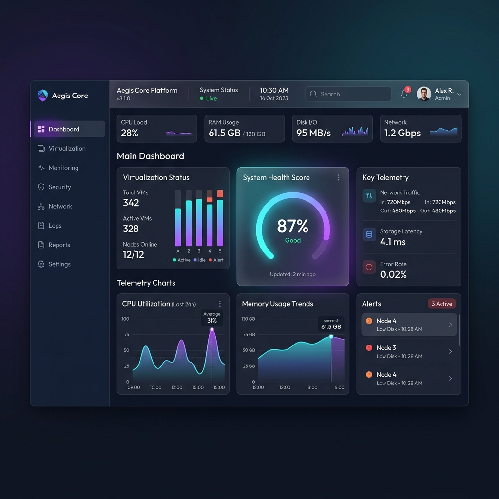
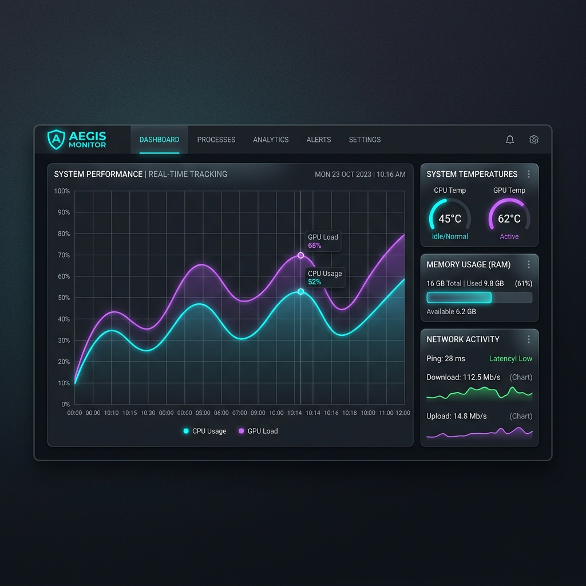
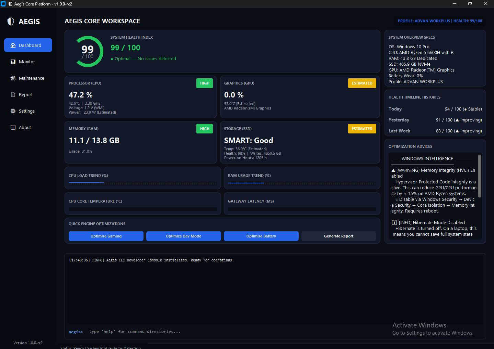
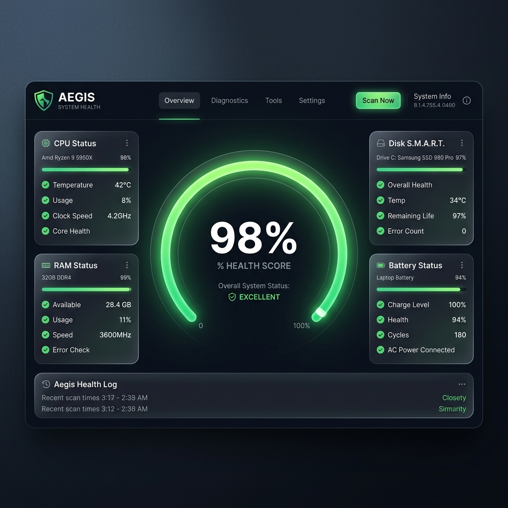

# 🛡 Aegis Core Platform

[](https://github.com/Voonaa/aegis-core/actions)
[](https://github.com/Voonaa/aegis-core/releases)
[](https://www.python.org/)
[](LICENSE)
[](#)
[](https://github.com/Voonaa/aegis-core/actions)
[](#)
[](https://mypy-lang.org/)
[](https://docs.astral.sh/ruff/)

> **One Click. One Platform. Total Control.**
> An enterprise-grade, modular Windows Diagnostics & System Management Platform engineered to analyze hardware telemetry, run async repair jobs, and dynamically score host health.

*Built for Windows diagnostics, optimization, and hardware telemetry with enterprise-grade architecture.*

---

## Table of Contents

- [Why Aegis?](#-why-aegis)
- [Features](#-features)
- [Screenshots](#-screenshots)
- [Quick Start](#-quick-start)
- [Core Technologies](#-core-technologies)
- [Architecture](#-architecture)
- [Documentation](#-documentation)
- [Download](#-download)
- [License](#-license)
- [Contributors](#-contributors)

---

## 💡 Why Aegis?

- 🏛 **Enterprise Architecture** — Decoupled monorepo with Dependency Injection, HAL, and EventBus — built to scale.
- ⚡ **Real-Time Diagnostics** — Live WMI & psutil polling for CPU, RAM, GPU, Disk, and Battery.
- 🔌 **Extensible by Design** — Drop a folder into `plugins/` and Aegis loads it automatically at runtime.
- 🧪 **Production Quality** — 99 unit tests, MyPy type-safe, Ruff-linted, and 80%+ code coverage.
- 📦 **Zero-Install Ready** — Ships as a self-contained portable `.zip` with automated CI/CD release pipeline.

---

## 🚀 Features

Aegis Core is an enterprise-grade Windows diagnostics platform designed for developers, IT administrators, power users, and hardware enthusiasts.

- **Hardware Abstraction Layer (HAL)**: Live WMI & psutil polling for CPU, RAM, GPU, Disk, and Battery metrics.
- **Async Job Manager**: Thread-safe background scheduler for SFC, DISM, and CHKDSK — UI never freezes.
- **Health Scoring Engine**: Rules-based engine scores system health (0–100) with context-aware recommendations.
- **Strategy-Based Export**: Export telemetry history to `CSV`, `JSON`, `Markdown`, or `HTML`.
- **Plugin SDK**: Folder-based runtime extensions with manifest validation, lifecycle hooks, and DI integration.
- **Design Token Theming**: All visual parameters defined in `theme.json` — customizable without touching code.

---

## 📸 Screenshots

## Dashboard
Displays real-time WMI telemetry, dynamic health score, system profile overlay, and recommendation engine alerts.


## Monitor
Tracks CPU core loads, GPU VRAM, RAM usage, motherboard temperatures, and disk health in live charts.


## Optimization
Manages Performance, Balanced, and Power Saver presets with safe-guard confirmation dialogs.


## Report
Compiles SMART indicators, battery wear cycles, CPU thermal zone data, and full diagnostic checklists.


## Settings
Controls UI theme scaling, CustomTkinter appearance, and third-party plugin lifecycle states.


---

## ⚡ Quick Start

```powershell
# 1. Clone the repository
git clone https://github.com/Voonaa/aegis-core.git
cd aegis-core

# 2. Install dependencies
pip install -r requirements.txt

# 3. Launch
$env:PYTHONPATH = "."
python apps/desktop/main.py
```

> For full setup instructions, see the [Developer Guide](docs/developer-guide.md).

---

## 🔧 Core Technologies

| Layer | Technology |
|:---|:---|
| Language | Python 3.14 |
| UI | CustomTkinter |
| Diagnostics | WMI + psutil |
| Testing | Pytest |
| CI/CD | GitHub Actions |
| Quality | Ruff + MyPy |

---

## 🏛 Architecture

Aegis is engineered as a **decoupled monorepo**, cleanly isolating core systems, desktop presentation, and dynamic extensions.

```text
Aegis Core Platform
├── apps/desktop/     # CustomTkinter GUI layer
├── packages/core/    # HAL engines, DI container, EventBus, services
├── packages/sdk/     # Public API (HardwareSDK, RepairSDK, ReportSDK)
├── plugins/          # Runtime manifest extensions
└── tests/            # 99-test unit suite
```

```text
Hardware (WMI/psutil) → HAL → TelemetrySnapshot → HealthEngine → EventBus → GUI
```

> See [ARCHITECTURE.md](docs/ARCHITECTURE.md) for the full design pattern breakdown.

---

## 📚 Documentation

| Document | Description |
|:---|:---|
| [ARCHITECTURE.md](docs/ARCHITECTURE.md) | Monorepo layout, DI, HAL, EventBus, data flow |
| [Developer Guide](docs/developer-guide.md) | Setup, tests, linting, git workflow, conventions |
| [SDK Reference](docs/sdk.md) | HardwareSDK, RepairSDK, ReportSDK API reference |
| [Plugin System](docs/plugins.md) | manifest.json, lifecycle hooks, permission model |
| [CLI Reference](docs/cli.md) | Command-line interface usage and examples |
| [Release Guide](docs/release-guide.md) | Local build, GitHub Actions workflow, versioning |
| [ROADMAP.md](docs/ROADMAP.md) | Sprint history, current phase, future plans |
| [FAQ](docs/faq.md) | Common questions on installation & usage |
| [CHANGELOG](CHANGELOG.md) | Detailed per-release change log |

---

## 📦 Download

| Package | Format | Link |
|:---|:---:|:---|
| Portable Edition | `.zip` | [GitHub Releases](https://github.com/Voonaa/aegis-core/releases) |
| Windows Installer | `.exe` | [GitHub Releases](https://github.com/Voonaa/aegis-core/releases) |

SHA256 checksums are provided for every release artifact.

---

## 🛡 License

This project is licensed under the **MIT License** — see [LICENSE](LICENSE) for details.

---

## 🤝 Contributors

| | |
|:---:|:---|
| **Agus Marpaung** | Project Author & Maintainer |

[](https://github.com/Voonaa)

Contributions are welcome! Please read [CONTRIBUTING.md](CONTRIBUTING.md) before submitting a pull request.
