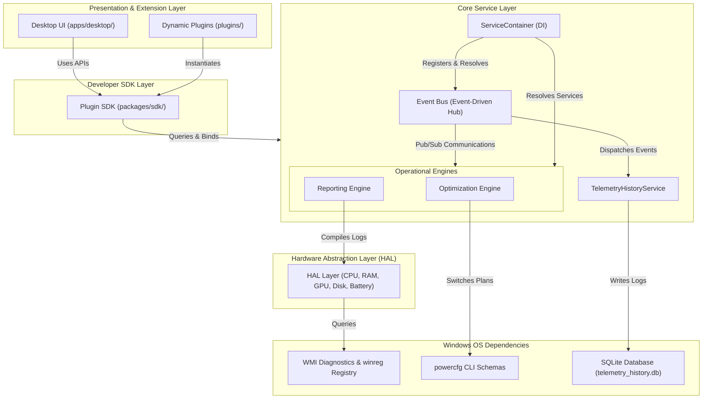
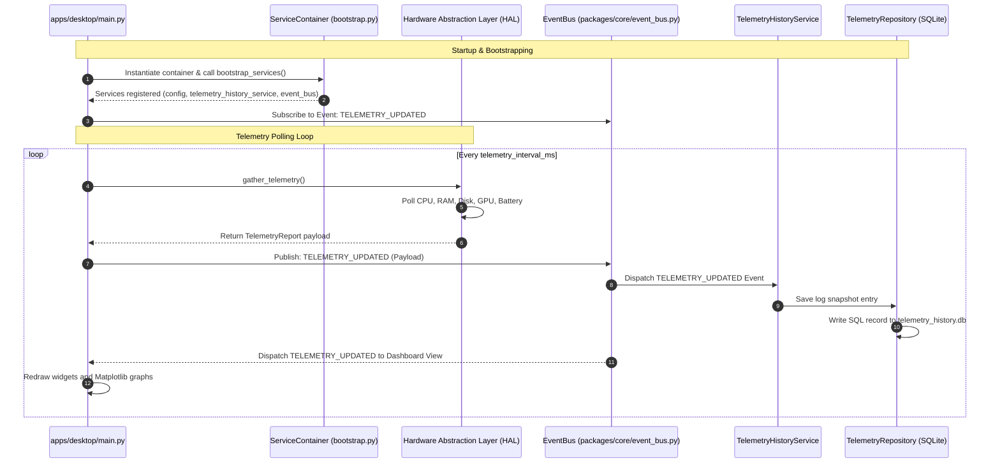

# Architecture Overview

Aegis Core Platform is designed around clean, decoupled monorepo architectural layers. Business logic and hardware data collection services are segregated from user interface configurations, allowing headless operations, SDK scripting, and third-party extension plugins to run seamlessly on top of a unified core engine.

---

## Subsystems Architecture

The diagram below shows the high-level layers and interaction boundaries of the Aegis Core Platform:



---

## Technical Data Flow

The diagram below illustrates the lifecycle of system telemetry inside Aegis: from real-time hardware harvesting up to storage in local relational SQLite archives and dashboard updates.



---

## Monorepo Layout Structure

```text
aegis-core/
├── apps/
│   └── desktop/            # CustomTkinter client GUI
├── packages/
│   ├── core/               # Shared logic engine library
│   │   ├── hal/            # OS telemetry harvesters
│   │   ├── models/         # Telemetry database models
│   │   ├── repositories/   # SQLite SQL operations wrapper
│   │   └── services/       # Optimization, repair, and reporting services
│   └── sdk/                # Public developer hooks interfaces
└── plugins/                # Dynamic runtime DLL/script extensions
```

---

## Core Components Breakdown

### 1. Presentation Layer (Desktop UI)
Located in `apps/desktop/`, this layer implements a graphical desktop application using the **CustomTkinter** wrapper framework. It maps theme configurations to custom UI frames, including Live Telemetry dials, Interactive Console Shells, Optimization sliders, and Backup restorers.

### 2. Dependency Injection Container (DI)
The `ServiceContainer` class (`packages/core/container.py`) acts as the platform's DI registry. Standard core components are instantiated and registered once during boot via `bootstrap_services` (`packages/core/bootstrap.py`) to prevent service duplication and enforce a clean dependency graph.

### 3. Hardware Abstraction Layer (HAL)
HAL isolates direct system API calls (such as `winreg` registry access, `psutil` queries, and `WMI` Windows diagnostic interfaces) into decoupled modules:
-   `CpuHAL`: Resolves model names, core usage averages, and thermal zone temperatures.
-   `RamHAL`: Polls virtual and physical memory metrics.
-   `StorageHAL`: Reads partition statistics and query S.M.A.R.T drive health bytes.
-   `BatteryHAL`: Measures power capacities, degradation levels, and charge states.
-   `GpuHAL`: Queries active display adapters load factors and VRAM spaces.

### 4. Event Bus
The `EventBus` (`packages/core/event_bus.py`) acts as a central pub/sub hub. Component dependencies are kept to a minimum by subscribing and publishing to event strings (e.g. `events.TELEMETRY_UPDATED` or `events.OPTIMIZATION_APPLIED`).

### 5. Plugin Loader
The `PluginLoader` (`packages/core/plugins/loader.py`) scans the local `/plugins` directories. It validates `manifest.json` parameter blocks, enforces permission boundaries, and invokes plugin hooks (`initialize()`, `start()`, `dispose()`) inside secondary execution scopes.

### 6. Relational History Repository
Historical performance patterns are written to local `telemetry_history.db` SQLite files. Database access is managed exclusively by the `TelemetryRepository` (`packages/core/repositories/telemetry_repository.py`) to isolate raw SQL queries from business logic handlers.

### 7. Optimization Engine (Optimization Service)
Coordinates power state tuning by combining three service parts:
-   `OptimizationPlanner`: Formulates execution scripts based on target presets.
-   `OptimizationExecutor`: Elevates permissions and invokes `powercfg` switches.
-   `RollbackEngine`: Writes JSON restore checkpoints to reverse adjustments.

### 8. System Reporting Engine (Report Service)
Compiles telemetries diagnostics, recommendations, and anomaly issues, outputting styled HTML, structured JSON, Markdown, and tabular CSV files inside the `reports/` folder.
