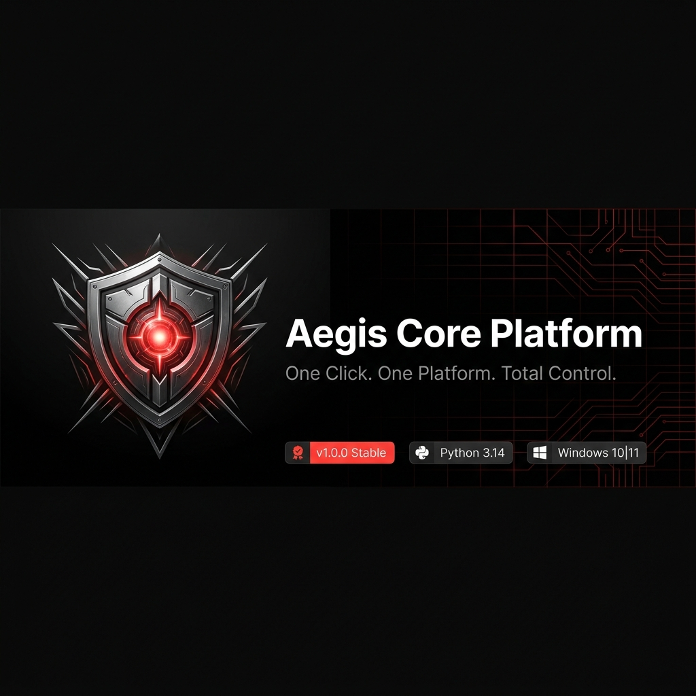

# Aegis Core Platform

  

  <b>One Click. One Platform. Total Control.</b>

  <a href="https://github.com/Voonaa/aegis-core/releases" class="md-button md-button--primary" style="margin: 5px; background-color: #FF3B3B; border-color: #FF3B3B; color: white;">:material-download: Download Latest Release</a>
  <a href="https://github.com/Voonaa/aegis-core" class="md-button" style="margin: 5px; border-color: #FF3B3B; color: white;">:material-github: View Source Code</a>

---

## Technical Statistics

### **126**
:material-check-decagram: Unit Tests Passing

### **70%+**
:material-shield-percent: Test Suite Coverage

### **Win 10/11**
:material-microsoft-windows: Supported Target OS

### **Python 3.14**
:material-language-python: Modern Interpreter

### **v1.0.0**
:material-tag-outline: Production Stable

---

## Overview

Welcome to the official documentation site for the **Aegis Core Platform**.

Aegis is an enterprise-grade Windows diagnostics, hardware telemetry, and performance optimization platform. Built using a robust, decoupled Python monorepo architecture, Aegis integrates real-time hardware queries, secure UAC privilege elevation routines, relational sqlite analytics logging, multi-format exporter pipelines, and dynamic client user interfaces.

  

---

## Key Features

-   **:material-lightning-bolt: Real-Time Telemetry**
    -   Live hardware polling via direct Hardware Abstraction Layer (HAL) queries.
    -   Detailed insights on CPU clocks, RAM allocations, GPU metrics, storage SMART diagnostics, and battery capacities.

-   **:material-tune: Modular Optimization**
    -   Switch profiles seamlessly: **Performance**, **Balanced**, or **PowerSaver**.
    -   Safe power scheme registry overrides mapped dynamically to active hardware configurations.

-   **:material-wrench: System Repairs**
    -   Trigger asynchronous background diagnostic runners for SFC (System File Checker), DISM (Deployment Image Servicing), and CHKDSK.
    -   Keep your system healthy with automated, background maintenance routines.

-   **:material-chart-line: Historical Analytics**
    -   Local SQLite database storing 7-day rolling performance trends.
    -   Export metrics to CSV, JSON logs, Markdown tables, or print-ready HTML templates.

---

## Quick Links

-   [🚀 Getting Started](getting-started.md) — Understanding the core concepts of Aegis.
-   [💾 Installation Guide](installation.md) — Set up Aegis via sources or prebuilt portable binaries.
-   [🏗 Architecture Overview](architecture.md) — Dive into DI Containers, Event Buses, and HAL patterns.
-   [💻 CLI Reference](cli.md) — Command line guides for headless diagnostics.
-   [🔌 Plugin Development](plugins.md) — Learn how to extend the Aegis engine using dynamic runtimes.

---

## Project Status

-   **Current Version**: `v1.0.0` (Stable Gold Release)
-   **GitHub Repository**: [Aegis Core on GitHub](https://github.com/Voonaa/aegis-core)
-   **Target OS**: Windows 10 / 11 (Requires administrative privileges for full diagnostics)
