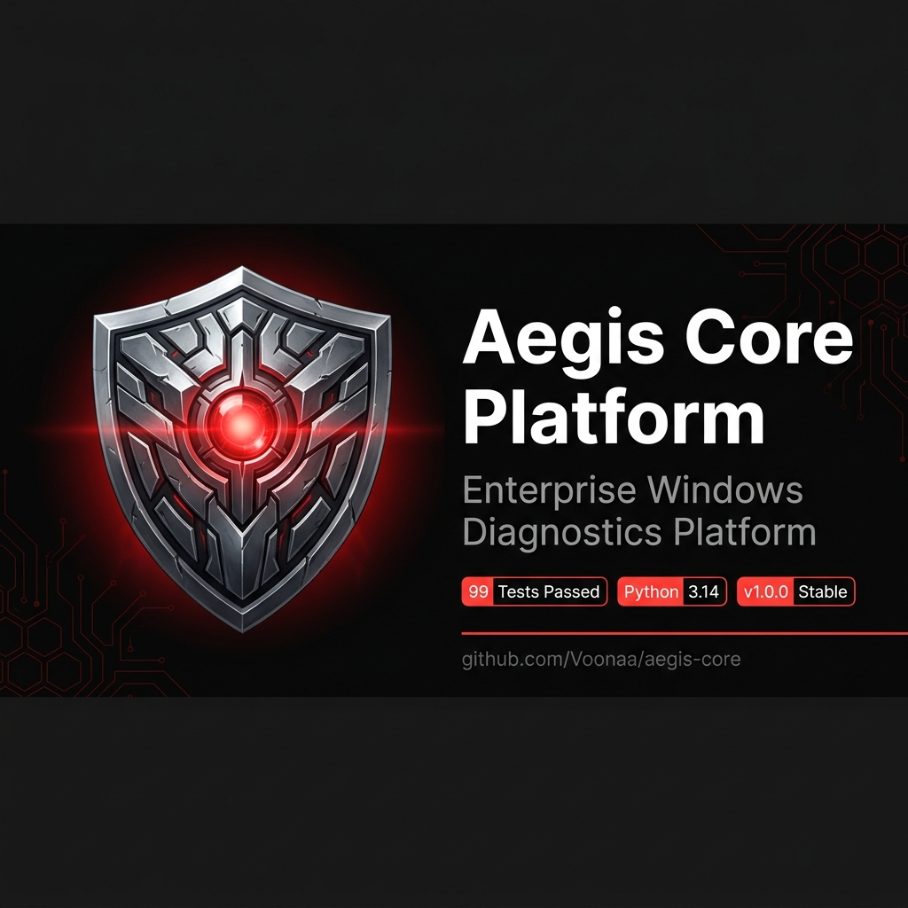
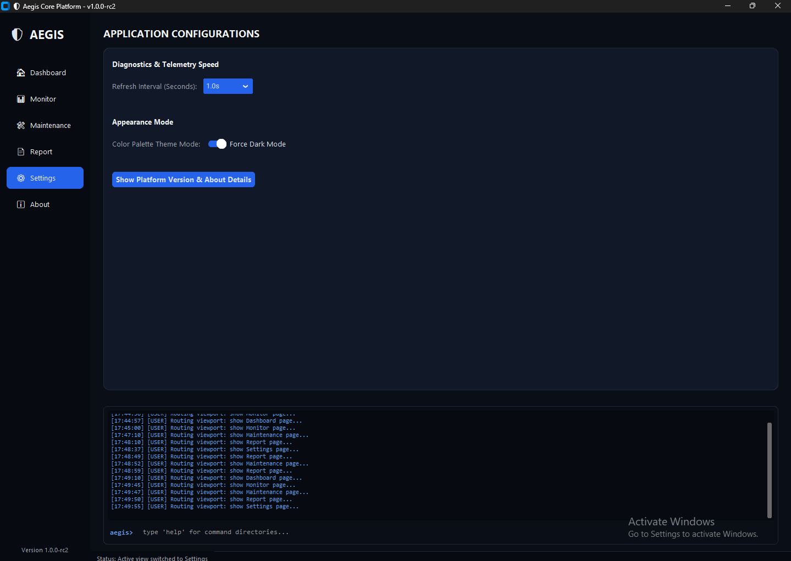

# Installation

Aegis Core Platform can be deployed using two primary approaches:
1.  **Developer Source Setup**: Recommended for developers, contributors, and users who want to query or extend the platform via the SDK or plugins.
2.  **Binary Distribution Package**: Prebuilt packages compiled for ease-of-use (available as a Portable ZIP or standard Windows Setup Installer).

---

## 1. Developer Source Setup

To configure Aegis on a local development machine, follow these steps.

### Prerequisites
-   **Target OS**: Microsoft Windows 10 or Windows 11 (required for HAL WMI telemetry bindings).
-   **Python version**: Python 3.11, 3.12, or 3.14.
-   **Git**: Git version 2.40 or higher.
-   **PowerShell**: Version 5.1 or higher (required to execute setup and quality script workflows).

### Step-by-Step Installation

1.  **Clone the Repository**:
    Retrieve the source codebase from GitHub:
    ```powershell
    git clone https://github.com/Voonaa/aegis-core.git
    cd aegis-core
    ```

    <p align="center">
      
    </p>

2.  **Configure Virtual Environment**:
    Create a isolated sandbox Python environment to manage dependencies locally:
    ```powershell
    python -m venv .venv
    .venv\Scripts\Activate.ps1
    ```

3.  **Install Dependencies**:
    Ensure all application packages and development requirements are installed:
    ```powershell
    # Install runtime production library dependencies
    pip install -r requirements.txt

    # Install linting, typechecking, and unit-testing libraries
    pip install -r requirements-dev.txt
    ```

4.  **Execute Platform CLI or UI Desktop**:
    Launch the GUI or execute CLI commands. Note that you **must** append the project root folder to `PYTHONPATH` so Python can resolve nested monorepo packages.
    ```powershell
    # Set PYTHONPATH
    $env:PYTHONPATH = "."

    # Launch graphical desktop application
    python apps/desktop/main.py

    # Alternately, run headless telemetry stats in console
    python -m packages.core.cli telemetry stats
    ```

> [!IMPORTANT]
> **Privileged Execution Requirement**:  
> For full functionality, Aegis should be executed inside an elevated terminal session (**Run as Administrator**). Several hardware queries (such as CPU socket temperature zones) and repair commands (SFC / DISM) will fail or return incomplete results under standard user permissions.

---

## 2. Prebuilt Binary Distributions

If you prefer not to compile Aegis from source, you can obtain officially verified build artifacts from the [GitHub Releases Page](https://github.com/Voonaa/aegis-core/releases).

### Portable Package (`AegisPortable.zip`)
-   **Description**: A self-contained folder including all compiled scripts, configuration overrides, default theme schemas, and a launch script.
-   **Installation**:
    1. Download `AegisPortable.zip` from the release assets list.
    2. Extract the archive into a folder of your choice (e.g., `C:\Tools\Aegis`).
    3. Run `Aegis.bat` with Administrative privileges to launch the application interface.
-   **Registry Footprint**: Zero. No system environment variables or uninstall entries are registered.

    <p align="center">
      
    </p>

### Installer Setup Package (`AegisSetup.exe`)
-   **Description**: A standard Inno Setup Windows installer that automates directory mappings and creates desktop launcher shortcuts.
-   **Installation**:
    1. Download `AegisSetup.exe`.
    2. Execute the installer. Approve the Windows UAC (User Account Control) prompt.
    3. Follow the wizard steps. The setup configures files directly inside `C:\Program Files\Aegis\`.
    4. Launch the application from the Start Menu or Desktop shortcut.
-   **Uninstallation**: Seamlessly remove the software registry markers and folders through the Windows Control Panel ("Add or Remove Programs").

    <p align="center">
      
    </p>
