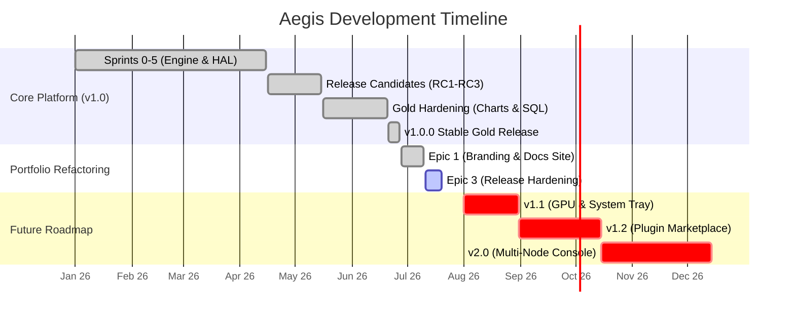

# Project Roadmap

This roadmap outlines the milestones completed during the development of the Aegis Core Platform and charts the future development path.

---

## Development Timeline

The interactive Gantt chart below illustrates the historical sprint layout, current gold portfolio focus, and estimated schedules for future feature deployments:

---

## Sprint History (Completed)

Aegis has evolved through several developmental phases:

| Milestone | Status | Focus Area / Primary Deliverables |
|:---|:---:|:---|
| **Sprint 0** — Engineering Foundation | Completed | Created the Software Requirements Specification (SRS), Architecture Decision Records (ADRs), and initial design systems. |
| **Sprint 1** — Monorepo Architecture | Completed | Set up the monorepo structure, dependency injection containers, event bus networks, and configuration templates. |
| **Sprint 2** — Application Interface | Completed | Built the CustomTkinter presentation layers, dashboard layouts, and sidebar navigation controllers. |
| **Sprint 3** — Telemetry Infrastructure | Completed | Configured HAL queries (CPU, RAM, GPU, Disk, Battery) and the weighted Health Score engine. |
| **Sprint 4** — System Repair Jobs | Completed | Built the asynchronous task scheduler and integrated SFC, DISM, and CHKDSK command runners. |
| **Sprint 5** — Extensibility Layer | Completed | Implemented the dynamic Plugin Loader and created the public SDK class API layer. |
| **RC 1** — Monorepo Restructuring | Completed | Refactored the repository layout, configured Pytest, and set up typechecking with Ruff and MyPy. |
| **RC 2** — UI Design Calibration | Completed | Polished design tokens, theme configurations, typography scales, and visual alignment. |
| **RC 3** — Distribution Engineering | Completed | Wrote the `release.ps1` automated release script, set up Inno Setup packaging, and added checksum manifests. |
| **Gold Phase** — Hardware Polling | Completed | Replaced telemetry simulation layers with live WMI and registry queries on real hardware. |
| **Gold Phase** — Dashboard Charts | Completed | Integrated Matplotlib line charts to show real-time performance and temperature trends. |
| **Gold Phase** — Database Logging | Completed | Developed SQLite database loggers, created clean-up automation, and built multi-format exporters (CSV/HTML/JSON/MD). |
| **v1.0.0 Stable Release** | **Released** | Released the first stable production build, featuring automated release pipeline validation. |
| **Gold Portfolio Sprint 1** | Completed | Refactored repository branding, updated documentation, and polished visual assets. |
| **Gold Portfolio Sprint 2** | Completed | Hardened the release pipeline, improved test coverage to **70%**, and resolved all pending TODO comments. |

---

## Future Considerations (Post v1.0)

These features are under consideration for future releases and are subject to Technical Lead approval:

### v1.1.0 — GPU Monitoring & System Tray Integration (Estimated Effort: Small)
-   Add temperature and fan speed monitoring for discrete NVIDIA/AMD graphics processors.
-   Implement a system tray launcher to monitor health scores in the background.

### v1.2.0 — Extended Plugin Marketplace (Estimated Effort: Medium)
-   Create a sandbox portal to discover, download, and toggle third-party plugin extensions directly from the UI settings.

### v2.0.0 — Distributed Multi-Node Telemetry (Estimated Effort: Large)
-   Build a remote monitoring dashboard to track telemetry from multiple networked client machines on a single dashboard page.
