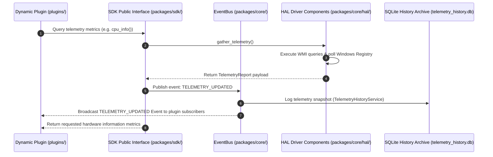

# SDK Reference Guide

The Aegis SDK provides clean, stable, and decoupled public APIs to query telemetry, execute system repairs, and compile health diagnostics programmatically from external scripts.

---

## SDK Namespace Overview

The SDK resides in `packages/sdk/` and exposes three primary class interfaces:

| Class Interface | Import Module | Primary Responsibility |
|:---|:---|:---|
| **`HardwareSDK`** | `packages.sdk.hardware` | Gathers real-time telemetry snapshots from the HAL layer. |
| **`RepairSDK`** | `packages.sdk.repair` | Triggers Windows system files SFC, DISM, and CHKDSK operations. |
| **`ReportSDK`** | `packages.sdk.report` | Triggers compilation of diagnostic reports in Markdown/JSON. |

---

## Telemetry Flow Control

The sequence diagram below highlights how plugin scripts call SDK interfaces to trigger queries, which then flow through the Event Bus to HAL drivers to return telemetry payloads:



---

## 1. `HardwareSDK`

Exposes real-time hardware variables polled from lower-level OS-specific components.

### Method Reference

#### `telemetry_report()` $\rightarrow$ `TelemetryReport`
Assembles a complete hardware diagnostic data payload:
-   **Returns**: A frozen `TelemetryReport` dataclass containing CPU, RAM, Disk, Battery, and OS info.

#### `cpu_info()` $\rightarrow$ `CPUInfo`
-   **Returns**: A `CPUInfo` object with fields: `utilization`, `temperature` (°C), `model_name`, `frequency_ghz`, `voltage`, and `power_draw_watts`.

#### `ram_info()` $\rightarrow$ `RAMInfo`
-   **Returns**: A `RAMInfo` object with fields: `used_gb`, `total_gb`, and `percentage`.

#### `storage_info()` $\rightarrow$ `DiskInfo`
-   **Returns**: A `DiskInfo` object with fields: `used_gb`, `total_gb`, `percentage`, `health_percent` (SMART), and `status` (`Healthy`/`Warning`/`Critical`).

#### `battery_info()` $\rightarrow$ `BatteryInfo`
-   **Returns**: A `BatteryInfo` object with fields: `percentage`, `is_charging`, `health_percent` (wear index), `time_remaining_mins`, and `cycle_count`.

#### `os_info()` $\rightarrow$ `OSInfo`
-   **Returns**: An `OSInfo` object with fields: `os_name`, `build_version`, `hyperv_active`, and `virtualization_conflict`.

---

## 2. `RepairSDK`

Submits Windows repair and diagnostics jobs to background worker threads.

### Method Reference

#### `sfc()` $\rightarrow$ `str`
Executes Windows System File Checker (`sfc /scannow`) asynchronously.
-   **Returns**: A unique background Job ID string (e.g. `job_sfc_...`).

#### `dism()` $\rightarrow$ `str`
Executes Deployment Image Servicing and Management (`DISM /Online /Cleanup-Image /RestoreHealth`) asynchronously.
-   **Returns**: A unique background Job ID string.

#### `chkdsk()` $\rightarrow$ `str`
Executes CHKDSK filesystem verification.
-   **Returns**: A unique background Job ID string.

#### `flush_dns()` $\rightarrow$ `str`
Flushes the Windows DNS resolver cache.
-   **Returns**: A unique background Job ID string.

#### `clean_temp()` $\rightarrow$ `str`
Deletes system temp files and cache.
-   **Returns**: A unique background Job ID string.

#### `clean_components()` $\rightarrow$ `str`
Performs component store cleanup (`DISM /StartComponentCleanup`).
-   **Returns**: A unique background Job ID string.

---

## 3. `ReportSDK`

Handles compilation of system reports.

### Method Reference

#### `generate()` $\rightarrow$ `str`
Compiles both structured JSON and Markdown diagnostic reports, writing them to the `reports/diagnostics/` folder.
-   **Returns**: Success message detailing target output paths.

---

## Complete Python Integration Script

Below is a complete, executable Python example demonstrating how to consume the Aegis SDK.

```python
import os
import sys
import time

# 1. Set environment PYTHONPATH path to project root
PROJECT_ROOT = os.path.abspath(os.path.dirname(__file__) if '__file__' in locals() else '.')
sys.path.append(PROJECT_ROOT)

from packages.sdk.hardware import HardwareSDK
from packages.sdk.repair import RepairSDK
from packages.sdk.report import ReportSDK
from packages.core.container import ServiceContainer
from packages.core.event_bus import EventBus

def handle_telemetry_event(data):
    print(f"[*] Telemetry update received! Health Score: {data.health_score} / 100")

def main():
    print("Initializing Aegis SDK Integration Program...")
    
    # 2. Configure event observers on EventBus
    container = ServiceContainer()
    event_bus = EventBus()
    container.register("event_bus", event_bus)
    event_bus.subscribe("TELEMETRY_UPDATED", handle_telemetry_event)

    # 3. Read Hardware Metrics
    print("\n--- GATHERING TELEMETRY ---")
    hw_sdk = HardwareSDK(container)
    
    # Gather CPU information
    cpu = hw_sdk.cpu_info()
    print(f"CPU Model       : {cpu.model_name}")
    print(f"CPU Thermals    : {cpu.temperature}°C (Load: {cpu.utilization}%)")
    
    # Gather Memory information
    ram = hw_sdk.ram_info()
    print(f"RAM Allocation  : {ram.used_gb:.2f} GB / {ram.total_gb:.2f} GB ({ram.percentage}%)")
    
    # Gather Battery information
    bat = hw_sdk.battery_info()
    print(f"Battery Capacity: {bat.percentage}% (Wear Health: {bat.health_percent}%)")

    # 4. Generate Diagnostics Reports
    print("\n--- GENERATING DIAGNOSTICS REPORT ---")
    rep_sdk = ReportSDK(container)
    result_message = rep_sdk.generate()
    print(result_message)

    # 5. Trigger System Maintenance Asynchronously
    print("\n--- TRIGGERING MAINTENANCE ---")
    repair_sdk = RepairSDK(container)
    job_id = repair_sdk.flush_dns()
    print(f"Background DNS Flush submitted successfully! Job ID: {job_id}")

if __name__ == "__main__":
    main()
```
