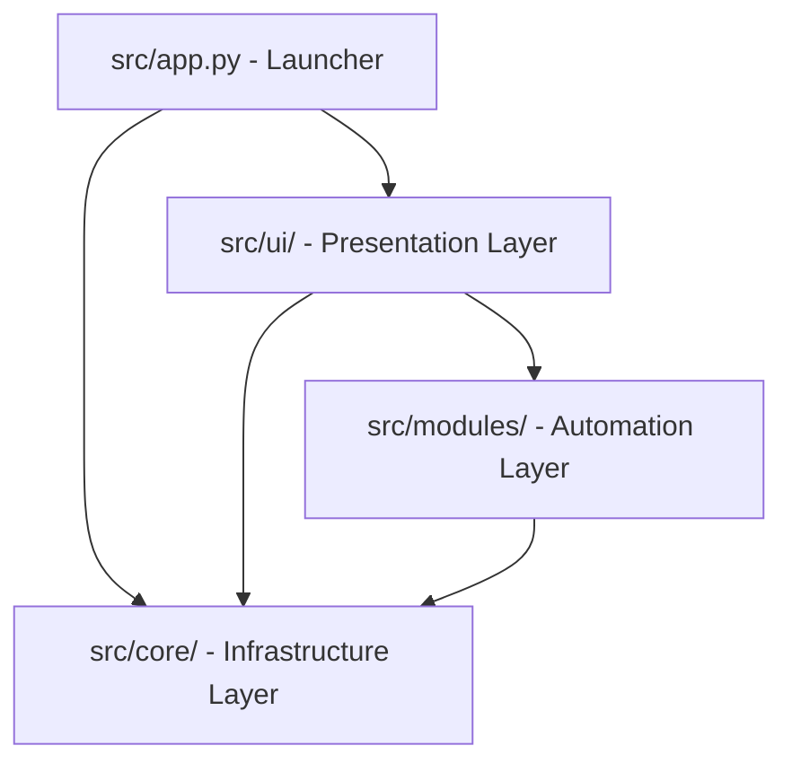

# Architectural Design: Aegis Toolkit

## 1. Modular Architectural Layers

Aegis is structured using a Clean Architecture design to maintain modularity.

### Layer Details

1. **Launcher (`src/app.py`)**:
   - Initializes configurations (`config/settings.json`), themes (`config/theme.json`).
   - Runs the main CustomTkinter window loop.

2. **Presentation Layer (`src/ui/`)**:
   - **`app.py`**: Holds main frame layouts, navigation, and sidebar bindings.
   - **`sidebar.py`**: Nav panel.
   - **`dashboard.py`**: Telemetry metrics, health score indicators, and Matplotlib trend line canvas.
   - **`widgets.py`**: Reusable elements: metric cards, custom progress indicators, log textboxes.
   - **`console.py`** (New UI Component): Embedded console CLI textbox and input field handler.

3. **Infrastructure Layer (`src/core/`)**:
   - **`hardware.py`**: High-frequency CPU/RAM monitors and slow-frequency WMI queries.
   - **`profile.py`** (New Core Component): Queries laptop manufacturer properties on boot and loads JSON profiles from `config/profiles/`.
   - **`powershell.py`**: Background script process executor.
   - **`logger.py`**: Logs file outputs to `logs/aegis.log` with subsystem categorizations.

4. **Automation / Module Layer (`src/modules/`)**:
   - Contains command executors and scripts.
   - Organizes tasks (SFC checks, updates, virtualization repairs, env vars exports).

---

## 2. Technical Communication Protocols

* **Polling Event Loops**: Hardware metrics are polled every 1000ms using CustomTkinter's `.after()` handler.
* **Worker Threads**: Heavy operations run asynchronously inside background threads to keep the UI responsive.
* **CLI Routing Engine**: Text commands entered in the Developer Console are routed through `modules/console_router.py` to trigger corresponding execution methods.
