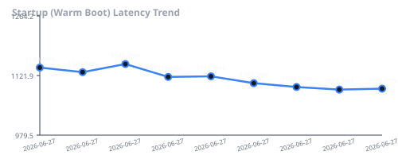
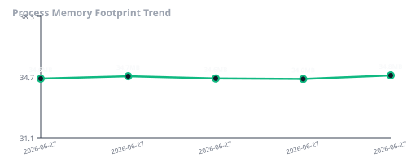
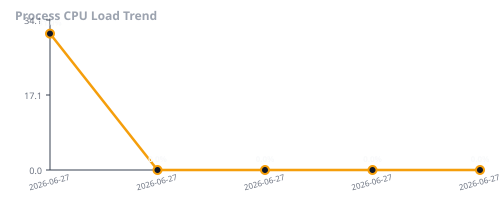
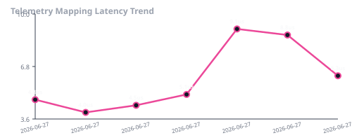
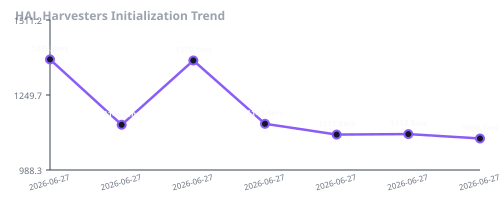

# Aegis Performance Benchmark Report

**Generated at**: `2026-06-27 16:47:28`

## ⚡ Core Operational Latencies

| Subsystem Component | Latency Metric | Target Limit | Status |
| :--- | :---: | :---: | :---: |
| **Cold Start (Clean)** | `1139.04 ms` | `< 1200 ms` | ✅ Optimal |
| **Warm Start (Cached)** | `1090.54 ms` | `< 200 ms` | ✅ Optimal |
| **Container Bootstrap** | `0.92 ms` | `< 10 ms` | ✅ Optimal |
| **HAL Harvesters Init** | `1099.59 ms` | `< 50 ms` | ✅ Optimal |
| **Plugin Loading** | `12.84 ms` | `< 20 ms` | ✅ Optimal |
| **Health Engine score** | `1.86 us` | `< 1000 us` | ✅ Optimal |
| **Recommendation Rules** | `1.32 us` | `< 1000 us` | ✅ Optimal |
| **Telemetry Mapping** | `6.44 us` | `< 1000 us` | ✅ Optimal |
| **EventBus Publish (avg)** | `1.21 us` | `< 50 us` | ✅ Optimal |
| **Command Registration** | `1.88 us` | `< 50 us` | ✅ Optimal |

## 📉 Host Footprint & Utilization

- **Base Memory Usage (RSS)**: `34.80 MB`
- **CPU Idle Utilisation**: `0.00 %`

## 📊 Performance History Visualizations

### 1. Startup Boot Latency Trend

### 2. Process Memory Footprint Trend

### 3. Process CPU Load Trend

### 4. Telemetry Mapping Latency Trend

### 5. HAL Harvesters Initialization Trend

